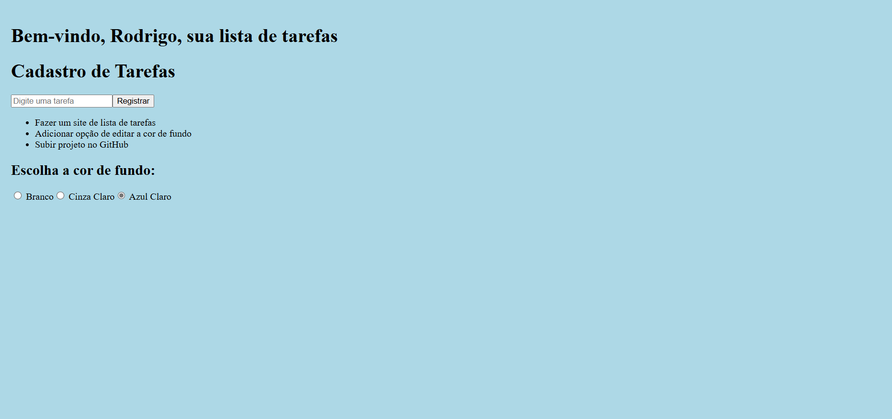

# Lista de Tarefas

Este é um projeto simples de lista de tarefas feito com React.js, permitindo que os usuários cadastrem e visualizem tarefas.

## 📌 Funcionalidades
✅ Cadastro de tarefas
✅ Armazenamento das tarefas no Local Storage
✅ Personalização da cor de fundo

---

## 🚀 Como instalar e rodar o projeto

### 1️⃣ Clonar o repositório
```bash
git clone https://github.com/Rodrigoscast/task-list.git
cd task-list
```

### 2️⃣ Instalar dependências
```bash
npm install
```

### 3️⃣ Rodar o projeto
```bash
npm start
O app será aberto em http://localhost:3000/.
```

### 🛠️ Tecnologias utilizadas
React.js ⚛️
Local Storage 💾
CSS3 🎨

### 📜 Estrutura do projeto
```bash
📂 task-list
 ┣ 📂 src
 ┃ ┣ 📂 components
 ┃ ┃ ┗ 📜 Cadastro.js   # Componente de cadastro de tarefas
 ┃ ┣ 📜 App.js          # Componente principal
 ┃ ┗ 📜 index.js        # Arquivo de entrada
 ┣ 📜 public/index.html # Estrutura principal do projeto
 ┣ 📜 README.md         # Documentação
 ┗ 📜 .gitignore        # Ignorar arquivos desnecessários

```

### 🎨 Imagem do projeto final


